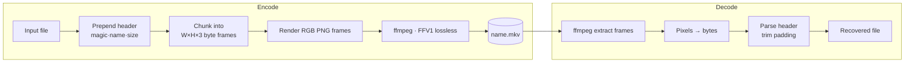

<div align="center">

# DeadCrypt 🎞️

**Turn any file into lossless "TV-static" video — and back, byte-for-byte.**

[](https://github.com/dev2180/DeadCrypt/actions/workflows/ci.yml)
[](https://www.python.org/downloads/)
[](LICENSE)
[-orange.svg)](https://ffmpeg.org/)

</div>

---

DeadCrypt serialises a file's raw bytes straight into the **red, green and blue
channels of video frames**. Each frame looks like the classic analog "no-signal"
static, but it is really your file in disguise. Encode it, store it, upload it,
share it as a video — then decode the video to reconstruct the **exact original
file**, with no data loss.

It's a fun demonstration of data representation, lossless codecs, and a
surprisingly practical way to smuggle arbitrary data through video-only
channels.

<div align="center">
<table>
<tr>
<td align="center"><code>secret.zip</code><br/>📦 any file</td>
<td align="center">→</td>
<td align="center">🟥🟩🟦<br/><b>RGB frames</b></td>
<td align="center">→</td>
<td align="center">🎞️<br/><code>secret.zip.mkv</code></td>
<td align="center">→</td>
<td align="center"><code>secret.zip</code><br/>✅ identical</td>
</tr>
</table>
</div>

## Table of contents

- [How it works](#how-it-works)
- [Architecture](#architecture)
- [Features](#features)
- [Installation](#installation)
- [Usage](#usage)
- [Resolution & capacity](#resolution--capacity)
- [Project layout](#project-layout)
- [Development](#development)
- [FAQ](#faq)
- [Roadmap](#roadmap)
- [License](#license)

## How it works

Every pixel holds **3 bytes** (one per RGB channel). DeadCrypt simply lays a
file's bytes across pixels, frame after frame:

1. **Header.** A small self-describing header (`magic + version + filename +
   size`) is prepended to the file's bytes so the video can be decoded even if
   it is renamed. → [`deadcrypt/core.py`](deadcrypt/core.py)
2. **Framing.** The byte stream is chunked into `width × height × 3`-byte frames.
   The final frame is zero-padded to fill the resolution.
3. **Encoding.** Frames are muxed into an `.mkv` with the **FFV1** codec — a
   *mathematically lossless* codec, so no pixel (and therefore no byte) is ever
   altered. → [`deadcrypt/encoder.py`](deadcrypt/encoder.py)
4. **Decoding.** ffmpeg extracts the frames, the pixels are read back as bytes,
   the header is parsed, padding is trimmed, and the original file is restored.
   → [`deadcrypt/decoder.py`](deadcrypt/decoder.py)

> [!IMPORTANT]
> Losslessness depends entirely on a lossless codec. FFV1 in an `.mkv` container
> guarantees it. If you re-encode the video with a lossy codec (H.264, VP9) or
> upload it to a platform that transcodes it, the bytes change and the file can
> no longer be recovered.

## Architecture



The encoder and decoder share all serialisation logic through
[`deadcrypt/core.py`](deadcrypt/core.py), so the two halves can never drift out
of sync. See [`docs/architecture.md`](docs/architecture.md) for the design
rationale, container-header format, and trade-offs.

## Features

- 🔁 **Lossless round-trip** — recovered files are byte-for-byte identical (SHA-256 verified in tests).
- 🧾 **Self-describing videos** — metadata lives *inside* the stream; rename the `.mkv` freely.
- 🖥️ **Real CLI** — scriptable `encode` / `decode` subcommands *and* a friendly interactive mode.
- 📐 **7 resolutions** — from 240p to 4K, trading frame count against frame size.
- 🧱 **Clean package** — typed, documented `deadcrypt` package with a reusable Python API.
- ✅ **Tested & CI'd** — unit tests plus an end-to-end ffmpeg round-trip on Python 3.9–3.12.
- ↩️ **Backwards compatible** — still decodes videos produced by the original filename-metadata format.

## Installation

**Prerequisites:** Python 3.9+ and [FFmpeg](https://ffmpeg.org/download.html) on
your `PATH`.

```bash
git clone https://github.com/dev2180/DeadCrypt.git
cd DeadCrypt

# Option A — install as a package (gives you the `deadcrypt` command)
pip install -e .

# Option B — just install the runtime dependencies
pip install -r requirements.txt
```

Verify FFmpeg is available:

```bash
ffmpeg -version
```

## Usage

### Command line

```bash
# Encode a file (defaults to 720p, written to ./encoded/)
deadcrypt encode path/to/secret.zip --resolution 1080p

# Decode a video back to the original file (written to ./decoded/)
deadcrypt decode encoded/secret.zip.mkv

# Interactive mode (menus for everything)
deadcrypt
```

Not installed as a package? Use the module form or the legacy scripts:

```bash
python -m deadcrypt.cli encode secret.zip -r 720p
python encoder.py   # original interactive workflow still works
python decoder.py
```

### Python API

```python
from deadcrypt import RESOLUTIONS, encode_file_to_video, decode_video_to_file

video = encode_file_to_video("secret.zip", RESOLUTIONS["5"])  # 1080p
original = decode_video_to_file(video)
print(original)  # decoded/secret.zip
```

## Resolution & capacity

Each frame stores `width × height × 3` bytes. Bigger frames mean fewer frames
for the same file (and a smaller header overhead per frame).

| Option | Label | Dimensions  | Bytes / frame | Capacity / frame |
|:------:|:------|:------------|--------------:|-----------------:|
| 1      | 240p  | 426 × 240   |       306,720 | ~0.29 MB         |
| 2      | 360p  | 640 × 360   |       691,200 | ~0.66 MB         |
| 3      | 480p  | 854 × 480   |     1,229,760 | ~1.17 MB         |
| 4      | 720p  | 1280 × 720  |     2,764,800 | ~2.64 MB         |
| 5      | 1080p | 1920 × 1080 |     6,220,800 | ~5.93 MB         |
| 6      | 1440p | 2560 × 1440 |    11,059,200 | ~10.55 MB        |
| 7      | 2160p | 3840 × 2160 |    24,883,200 | ~23.73 MB        |

> A 100 MB file at 1080p needs ⌈100 / 5.93⌉ ≈ **17 frames** — under a second of
> video at 24 fps.

## Project layout

```
DeadCrypt/
├── deadcrypt/             # the package
│   ├── core.py            # resolutions, container header, frame (de)serialisation
│   ├── encoder.py         # file  -> video
│   ├── decoder.py         # video -> file
│   └── cli.py             # argparse CLI + interactive mode
├── tests/                 # unit tests + ffmpeg round-trip test
├── docs/architecture.md   # design notes & container format
├── encoder.py / decoder.py# thin backwards-compatible shims
├── pyproject.toml         # packaging + console entry point
└── .github/workflows/ci.yml
```

## Development

```bash
pip install -e ".[dev]"
pytest -v
```

The unit tests (`tests/test_core.py`) run anywhere. The round-trip test
(`tests/test_roundtrip.py`) is skipped automatically when the `ffmpeg` binary is
not on `PATH`.

## FAQ

**Is this encryption?** No. Despite the name, the bytes are encoded, not
encrypted — anyone with DeadCrypt can decode the video. Encrypt the file *first*
(e.g. with `age` or 7-Zip) if you need confidentiality.

**Why FFV1 / `.mkv`?** FFV1 is lossless, so the decoded bytes equal the encoded
bytes. A lossy codec would corrupt the data.

**Can I upload the video to YouTube and decode it later?** Only if the platform
doesn't transcode it. Most do, which re-compresses the pixels and breaks the
round-trip. Treat DeadCrypt videos as exact files, not as streaming content.

**What's the overhead?** Output is roughly the size of the original file plus
container overhead (FFV1 compresses the highly-random pixel data only slightly).
It's a representation, not a compressor.

## Roadmap

- [ ] Optional symmetric encryption pass before encoding
- [ ] Per-frame CRC for tamper/corruption detection
- [ ] Progress + capacity estimate in the interactive menu
- [ ] Configurable codec/container backends

## License

Released under the [MIT License](LICENSE).
