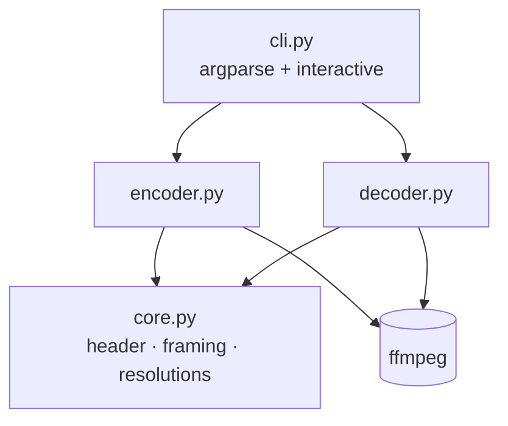

# DeadCrypt — Architecture & Design Notes

This document explains *how* DeadCrypt is built and *why* it is built that way.
It is aimed at contributors and reviewers who want the rationale behind the
code, not just usage instructions (see the [README](../README.md) for those).

## 1. Problem statement

> Represent an arbitrary file as a video such that the **exact** original bytes
> can be recovered from that video, and make the tool pleasant to use and easy
> to maintain.

Two hard requirements fall out of this:

1. **Lossless round-trip.** `decode(encode(file)) == file`, bit for bit.
2. **Self-containment.** A video should carry everything needed to decode it.

## 2. The core idea

A pixel in an RGB image is three bytes: `(R, G, B)`. A video is a sequence of
images. Therefore a video is just a (large) sequence of bytes laid out on a
grid. DeadCrypt exploits this directly:

```
file bytes ── chunk ──► [ b0 b1 b2 | b3 b4 b5 | ... ]  ── reshape ──►  H×W×3 frame
```

There is no transform, no DCT, no quantisation — bytes *are* the pixels. The
entire correctness of the system then hinges on one thing: **the codec must not
change a single pixel.**

### Why FFV1 in Matroska (`.mkv`)

| Codec       | Lossless? | Verdict                                            |
|-------------|-----------|----------------------------------------------------|
| H.264/H.265 | No        | ❌ Lossy by default; corrupts the bytes.           |
| VP9/AV1     | No        | ❌ Same problem.                                    |
| PNG sequence| Yes       | ✅ Works, but not a single shareable "video" file. |
| **FFV1**    | **Yes**   | ✅ Mathematically lossless, widely supported, mkv. |

FFV1 is an intra-frame, mathematically lossless codec maintained by the FFmpeg
project and used for digital film preservation. Wrapped in Matroska it gives us
a single portable file that survives a perfect round-trip.

> ⚠️ This guarantee ends the moment a *third party* re-encodes the video. Most
> upload platforms transcode to a lossy codec, which destroys the payload. A
> DeadCrypt video is an exact artifact, not streaming content.

## 3. The container header

Early versions stored metadata in the **filename**
(`name__WIDTHxHEIGHT__SIZE.mkv`). That is fragile: rename the file and it no
longer decodes; filenames containing `__` collide with the separator.

DeadCrypt now prepends a small, self-describing header **inside the byte
stream**, before framing. Layout (big-endian):

```
┌────────┬─────────┬──────────┬──────────────┬───────────┬─────────────────┐
│ magic  │ version │ name_len │   filename   │ data_len  │   file bytes…   │
│ 4 B    │ 1 B     │ 2 B      │  name_len B  │ 8 B       │                 │
│ "DCRT" │ 0x01    │ uint16   │   utf-8      │ uint64    │                 │
└────────┴─────────┴──────────┴──────────────┴───────────┴─────────────────┘
```

Consequences:

- **Rename-proof.** The video decodes regardless of its filename.
- **Versioned.** The `version` byte lets the format evolve without ambiguity.
- **Padding-safe.** `data_len` records the true size, so trailing zero padding
  in the last frame is trimmed exactly.

The legacy filename scheme is still understood on decode as a fallback, so old
videos keep working (see `_legacy_header_from_filename` in
[`deadcrypt/decoder.py`](../deadcrypt/decoder.py)).

## 4. Module boundaries



| Module        | Responsibility                                                        |
|---------------|-----------------------------------------------------------------------|
| `core.py`     | Single source of truth: resolutions, header (de)serialisation, framing. Pure Python + numpy, no ffmpeg. Independently unit-testable. |
| `encoder.py`  | File → header+bytes → frames → FFV1 mkv. Owns the ffmpeg *write* path. |
| `decoder.py`  | mkv → frames → bytes → parse header → file. Owns the ffmpeg *read* path and legacy fallback. |
| `cli.py`      | UX only: argument parsing, interactive menus, human-readable output.  |

**Why split `core` out?** The encoder and decoder must agree byte-for-byte on
the header format and framing maths. Putting that logic in one shared module
makes divergence impossible and means the trickiest code is testable without
spawning ffmpeg.

## 5. Key implementation decisions

- **Temp directories for frames.** Frames are written to a `tempfile`
  directory that is always cleaned up — even on error — instead of polluting the
  working directory (the original behaviour).
- **6-digit, 1-based frame names** (`frame_000001.png`). Zero-padding keeps
  lexical sort order equal to numeric order and matches the ffmpeg glob
  `frame_%06d.png` for up to 999,999 frames.
- **Streaming framing.** `iter_frames` is a generator, so the encoder writes
  frames one at a time rather than materialising every frame array in memory.
- **`run(quiet=True)`.** ffmpeg's own logging is suppressed; DeadCrypt presents
  its own concise progress via `tqdm`.

## 6. Testing strategy

- **`tests/test_core.py`** — fast, dependency-light unit tests for the header,
  framing/padding maths, and resolution resolution. Runs anywhere.
- **`tests/test_roundtrip.py`** — the real contract: encode → decode →
  byte-for-byte comparison across several payload sizes (including empty and
  1-byte files). Skipped automatically when `ffmpeg` is absent.
- **CI** runs both on Python 3.9 / 3.11 / 3.12 with ffmpeg installed.

## 7. Known limitations & future work

- **Not encryption.** The name is a pun; the payload is encoded, not encrypted.
  A future version could add an optional symmetric encryption pass before
  framing.
- **No integrity check beyond size.** A per-frame or whole-file CRC/SHA would
  let the decoder detect corruption rather than silently producing wrong bytes.
- **Single codec/container.** FFV1+mkv is hard-coded; a pluggable backend would
  allow other lossless targets.
